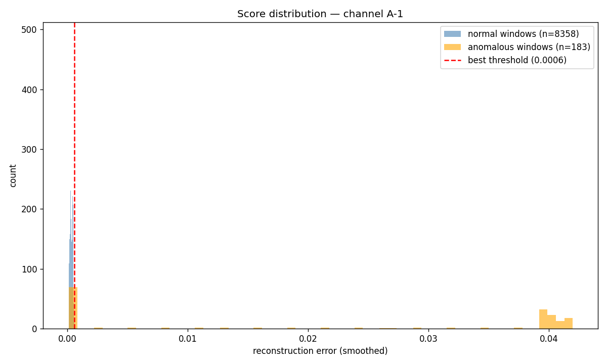
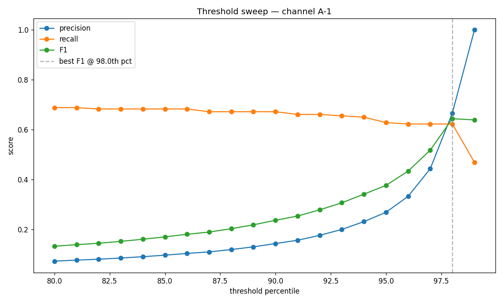
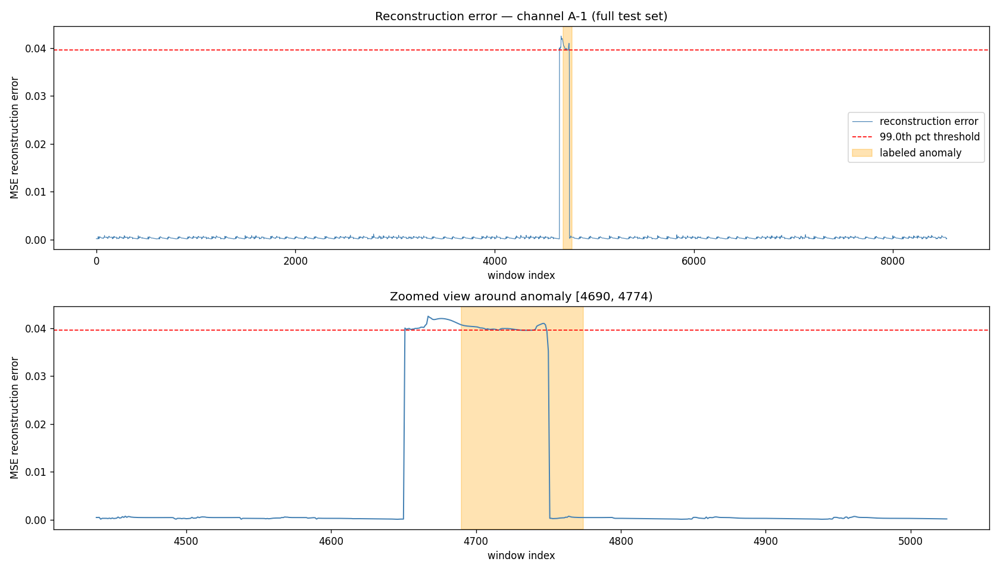

# Telemetry Anomaly Detection

Unsupervised anomaly detection for multivariate sensor telemetry, using an LSTM
autoencoder to flag early signs of equipment drift before failure.


## Problem

Systems instrumented with many sensors (temperature, vibration, current, position
encoders) generate continuous multivariate telemetry. Failures are rare and
usually undocumented, so supervised classification isn't viable — you need a
model that learns "normal" and flags deviation. This project builds an
unsupervised anomaly detector for multivariate time-series sensor data, using
the NASA SMAP/MSL spacecraft telemetry benchmark as a public stand-in for
industrial sensor streams.

## Approach

- **Data**: NASA SMAP/MSL telemetry anomaly benchmark (public, labeled anomaly
  windows for evaluation only — model itself trains unsupervised on "normal" data)
- **Method**: LSTM autoencoder — trained to reconstruct normal multivariate
  sequences; reconstruction error becomes the anomaly score
- **Why LSTM autoencoder over simpler baselines** (e.g. z-score, isolation forest):
  captures temporal dependency across sensor channels, not just point-wise outliers
- **Evaluation**: precision/recall against labeled anomaly windows, and a
  qualitative look at reconstruction error over time vs. known failure points

## Results

Trained an LSTM autoencoder on channel A-1. Reconstruction error was scored
on the primary telemetry feature only — averaging error across all 25
features (which include 24 one-hot command-context columns) diluted the
anomaly signal so severely that the model detected nothing at all
(precision=0.000, recall=0.000) before this change.

| Threshold | Precision | Recall | F1 |
|---|---|---|---|
| 99th pct (naive default) | 1.000 | 0.470 | 0.639 |
| 98th pct (tuned via threshold sweep) | 0.667 | 0.623 | **0.644** |





**Key findings:**
- Scoring on the primary telemetry channel alone (rather than averaging
  across all 25 features) was the decisive fix — moving from a
  non-functional detector to F1=0.639.
- Threshold tuning via a full precision/recall sweep gave a further small
  gain, and revealed that recall plateaus around 0.68 regardless of
  threshold — a structural limit, not a tuning issue.
- The plateau suggests windows only partially overlapping the labeled
  anomaly (near its start/end) don't score as clearly anomalous as
  windows that fully contain it — likely still some residual dilution
  even with single-feature scoring.

## What I'd Do Next

- Score using per-timestep error (only the window's last timestep) rather
  than per-window mean, to remove the remaining dilution at anomaly edges
- Try a shorter window size, closer to the typical anomaly duration
- Evaluate across more SMAP/MSL channels, not just A-1, to see how well
  this generalizes

## Architecture

```
Raw telemetry (multivariate) → Windowing/Normalization → LSTM Autoencoder
→ Reconstruction error → Thresholding → Anomaly flag
```

## Tech Stack

`Python` `PyTorch` `NumPy` `Pandas` `Matplotlib` `scikit-learn`

## Project Structure

```
telemetry-anomaly-detection/
├── data/            # download script / sample data (no large files committed)
├── notebooks/       # EDA and results notebooks
├── src/
│   ├── data_loader.py
│   ├── model.py
│   ├── train.py
│   └── evaluate.py
├── tests/
├── requirements.txt
└── README.md
```

## How to Run

```bash
pip install -r requirements.txt
python src/data_loader.py   # fetches/prepares data
python src/train.py
python src/evaluate.py
```

## What I'd Do Next

- Add a survival-analysis-based time-to-failure estimate alongside the binary
  anomaly flag
- Benchmark against a simpler statistical baseline to quantify the LSTM's
  actual lift
- Wrap as an API and containerize (see `mlops-predictive-maintenance` repo)

## About This Project

Adapted from the LSTM autoencoder approach I've been using to investigate
antenna pointing-drift monitoring at SKA-Mid (MeerKAT M030), applied here to
public NASA telemetry data since the operational data itself isn't shareable.
